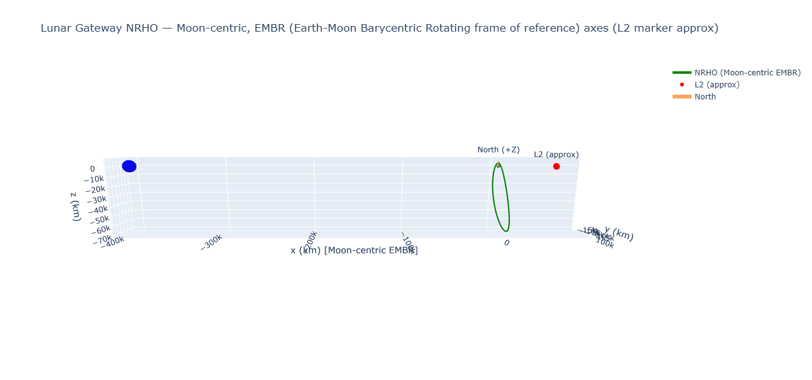

# halorbits

This Python project implements interactive 3D visualizations of

- The proposed [Near-Rectilinear Halo Orbit](https://en.wikipedia.org/wiki/Near-rectilinear_halo_orbit) for the
[Lunar Gateway](https://en.wikipedia.org/wiki/Lunar_Gateway).
- The trajectory of the [Genesis probe](https://en.wikipedia.org/wiki/Genesis_(spacecraft))

3D pan/tilt/zoom is supported via [Plotly](https://plotly.com/python/).

Preview:

👉 [Interactive version for Lunar Gateway](https://nbryant42.github.io/halorbits/nrho_plot.html)
(This works best in a desktop browser, in a maximized window, on a 16:9 monitor.)

👉 [Interactive version for Genesis probe](https://nbryant42.github.io/halorbits/genesis_halo_plot.html)